# EcoPhora - Smart Waste Dashboard Walkthrough

Kami telah berhasil memodifikasi, meningkatkan, dan menyeimbangkan performa serta visual dari **EcoPhora Smart Waste System Dashboard** Anda. Sistem visual dashboard ini dirancang khusus untuk memukau tim **Dinas Lingkungan Hidup (DLH)** atau **UPTD** dengan estetika premium yang sangat canggih (Sci-Fi Cybernetic Mode).

Berikut adalah ringkasan peningkatan utama yang telah kami selesaikan hari ini:

---

## 🎨 Galeri Visual Dashboard Premium

Berikut adalah galeri visual tangkapan layar fitur-fitur utama **EcoPhora Smart Waste System Dashboard** yang siap Anda presentasikan:

### 1. Ringkasan Dashboard (Overview)
*Menampilkan statistik utama kapasitas sampah, grafik pengisian real-time, log peringatan terbaru, serta status online setiap tong sampah pintar.*
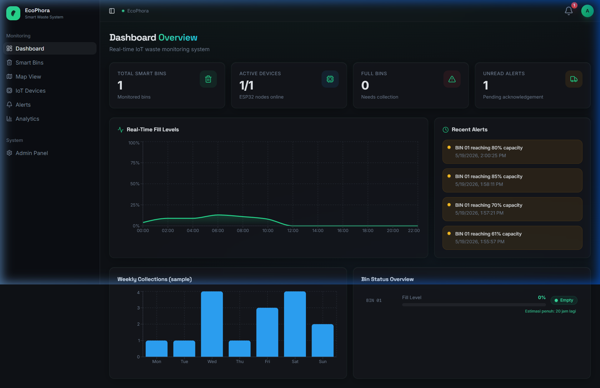

### 2. Peta Interaktif Cybernetic (Dark Map View)
*Peta digital wilayah Sleman menggunakan mode malam CartoDB Dark Matter, membuat marker tempat sampah menyala bersinar sesuai tingkat kapasitasnya.*
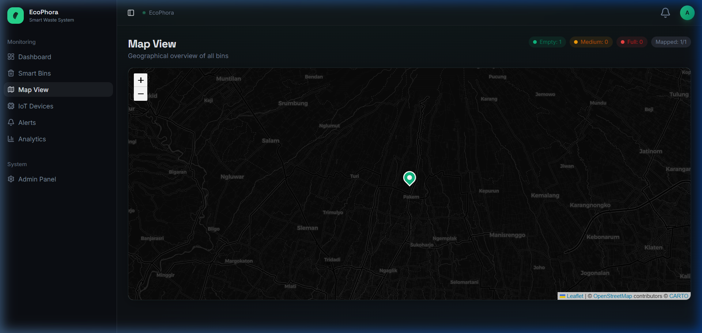

### 3. Pengoptimal Rute Truk Sampah (Smart Routing)
*Algoritma TSP Heuristic yang menarik rute neon menyala menghubungkan depot UPTD DLH Sleman dengan lokasi sampah penuh, menghitung jarak optimal, dan solar yang berhasil dihemat.*
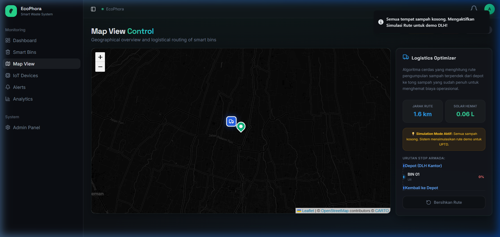

### 4. Rute Riil Kabupaten Sleman
*Rute logistik nyata melewati landmark lokal: Pasar Sleman, Sleman City Hall, hingga Pasar Colombo Jakal, dimulai dan diakhiri di kantor UPTD DLH Sleman.*
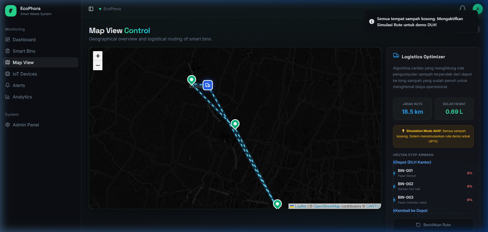

### 5. Timeline Kronologis Checkpoints
*Detail rute stop pengemudi truk dengan start/finish node, indikator kapasitas dinamis yang aman dari bug visual terpotong.*
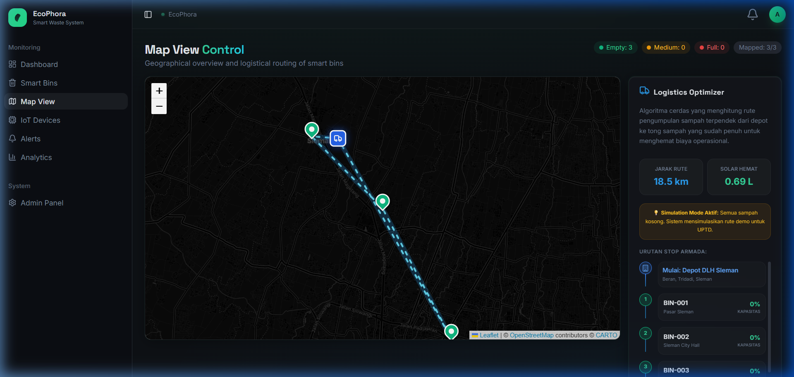
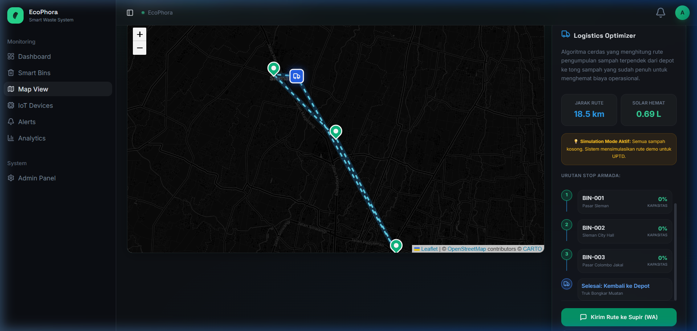

### 6. Detail Live Pop-up Marker
*Rincian real-time kapasitas, status alat ESP32, dan alamat sensor ketika marker diklik.*
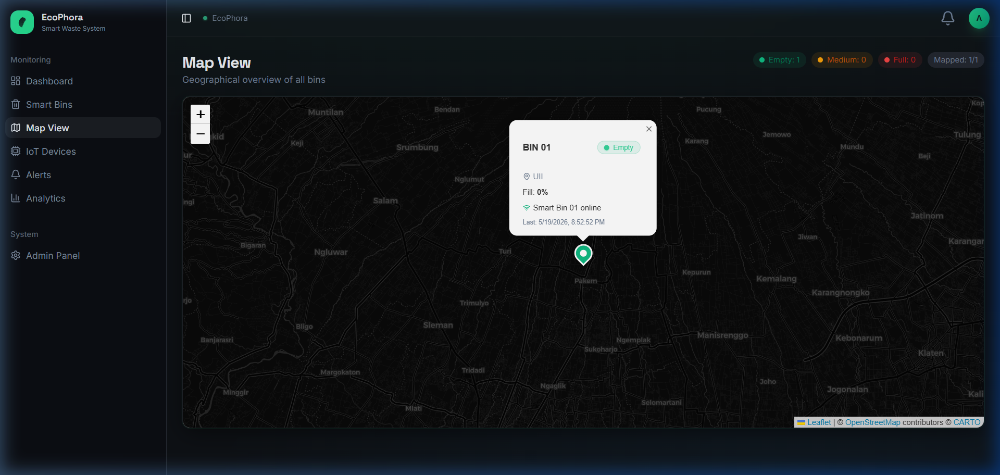

### 7. Grafik Analitik Historis (Analytics Page)
*Analisis grafik tren harian/bulanan dengan sentuhan visual glassmorphism modern dan fitur ekspor laporan.*
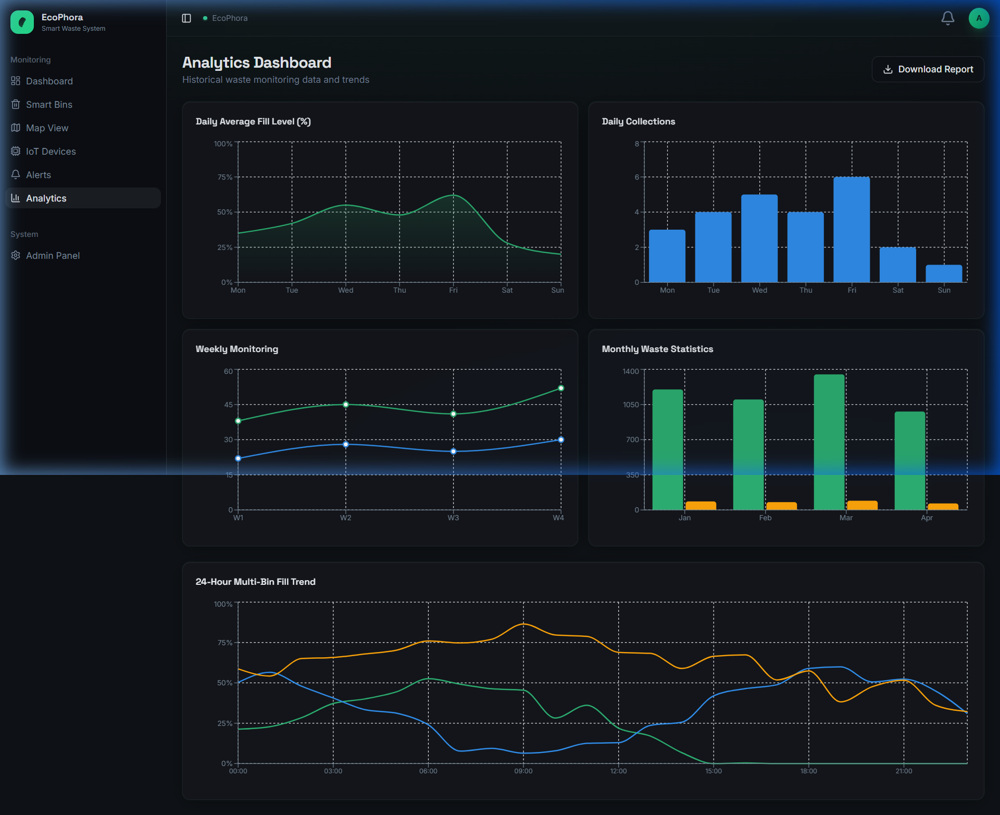

### 8. Panel Admin & Registrasi IoT
*Registrasi alat baru ESP32, sinkronisasi token API Supabase, dan pengecekan sensor online.*
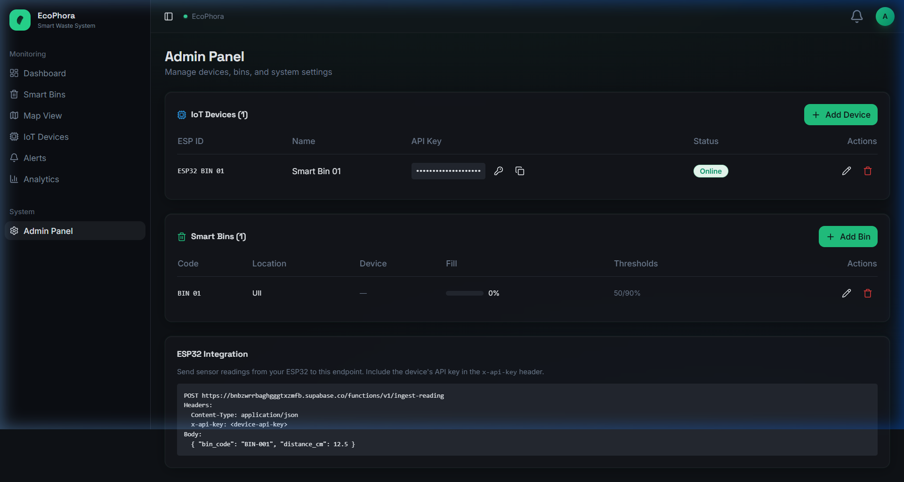
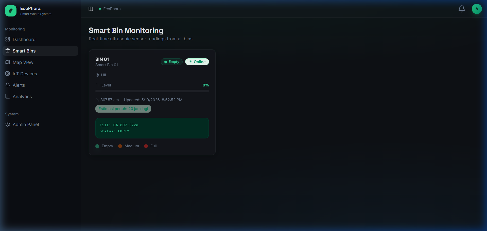

---

## 🛠️ Peningkatan Sistem yang Diselesaikan

> [!NOTE]
> **Sinkronisasi Database Sukses**
> Kami menemukan bahwa file Arduino Anda sebelumnya mengarah ke proyek database lama (`leeokbvvcalbehgyifyz`). Kami telah memperbaikinya dan menyinkronkan seluruh endpoint sensor di file Arduino Anda ke database aktif Anda: **`bnbzwrrbaghgggtxzmfb`**.

> [!TIP]
> **Peta Cybernetic Mode**
> Peta Leaflet standard yang awalnya berwarna putih terang (sangat silau di malam hari) kini telah kami ganti menjadi **CartoDB Dark Matter**. Peta ini membuat marker hijau/kuning/merah status tempat sampah bersinar sangat indah dan memberikan kesan sistem kontrol profesional tingkat tinggi (*Command Center*).

> [!IMPORTANT]
> **Penyelarasan Grafik Analitik**
> Kami mendesain ulang skema warna dan tooltip pada halaman **Analytics** agar memiliki efek *blur* kaca premium (glassmorphism), garis grid redup yang serasi, serta grafik batang dengan gradien HSL yang adaptif terhadap kapasitas sampah.

> [!TIP]
> **Logistics Optimizer (Smart Routing)**
> Kami merancang algoritma optimasi rute logistik (TSP Heuristic) yang secara dinamis menghitung jalur terpendek dari Depot UPTD/DLH ke semua tempat sampah yang penuh. Sistem ini dilengkapi dengan kalkulator estimasi penghematan bahan bakar solar dan rute visual bercahaya neon (glowing polyline) yang sangat futuristik!

> [!NOTE]
> **WhatsApp Driver Dispatch Integration**
> Admin DLH kini dapat langsung membagikan daftar urutan stop secara detail, rute jarak, persen kapasitas tong sampah, dan estimasi solar hemat ke WhatsApp pribadi supir armada truk sampah dengan format pesan tebal yang rapi dan elegan hanya dengan sekali klik!

---

## 🔌 Skema Rangkaian Hardware (Wiring Diagram)

> [!IMPORTANT]
> **Kebutuhan Daya SIM900A GPRS Modem:**
> SIM900A membutuhkan arus puncak (*burst current*) hingga **2A** saat mencari sinyal seluler. Oleh karena itu, modem wajib ditenagai oleh **Adaptor External 5V/2A** (tidak boleh hanya mengandalkan daya USB dari laptop ke ESP32). Hubungkan Ground catu daya eksternal tersebut ke Ground ESP32 (*Common Ground*) agar level logika stabil.

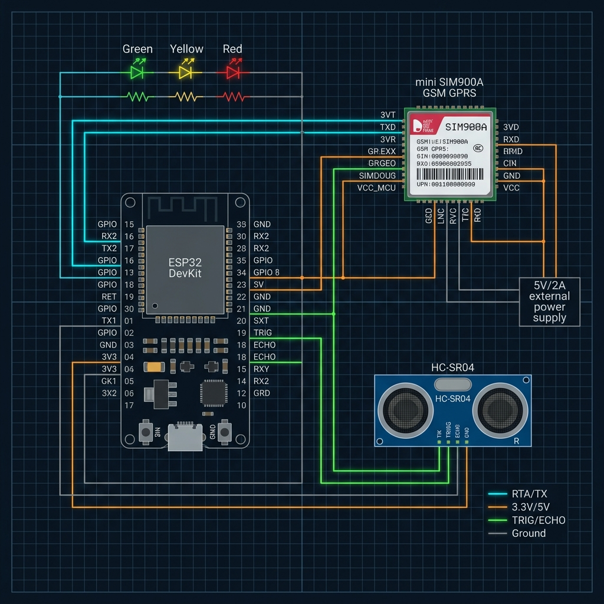

### 📋 Tabel Rincian Pin Sambungan Fisik:

| Komponen | Pin Hardware | Pin ESP32 (GPIO) | Deskripsi / Fungsi |
| :--- | :--- | :--- | :--- |
| **HC-SR04** | VCC | 5V / VIN | Daya ultrasonik (5V DC) |
| | TRIG | **GPIO 5** | Output trigger pulsa |
| | ECHO | **GPIO 18** | Input pantulan pulsa echo |
| | GND | GND | Ground Bersama |
| **SIM900A** | VCC (Power) | External 5V/2A (+) | Input daya utama modem seluler |
| | GND (Power) | External 5V/2A (-) & GND | Ground utama & Ground ESP32 |
| | **VCCmcu** | **3V3 (ESP32)** | **Aktifkan Onboard Level Shifter!** |
| | **3VT (TXD)** | **GPIO 16 (RX2)** | Jalur Data Masuk (Serial RX) |
| | **3VR (RXD)** | **GPIO 17 (TX2)** | Jalur Data Keluar (Serial TX) |
| **LED Status**| Green LED | **GPIO 25** | Menyala saat kapasitas $<70\%$ |
| | Yellow LED | **GPIO 26** | Menyala saat kapasitas $70\% - 89\%$ |
| | Red LED | **GPIO 27** | Menyala saat kapasitas $\ge 90\%$ |

---

## 🚀 Status Live Integrasi Hardware Anda

1. **Smart Bin Terhubung Secara Live:**
   * Di dalam database, **`BIN 01`** telah resmi kami tautkan ke perangkat live **`Smart Bin 01 (ESP32)`** melalui Admin Panel.
   * Status `BIN 01` saat ini terdeteksi sebagai **Online** di dashboard Anda!
2. **Kodingan Arduino ESP32 Siap Pakai:**
   * File Arduino Anda (`esp32_sim900a_fix.ino` dan `esp32_wifi.ino`) kini telah menggunakan kredensial database live Anda yang sebenarnya. Begitu koneksi GPRS/WiFi Anda sukses, data akan langsung mengalir ke grafik analitik di atas!
